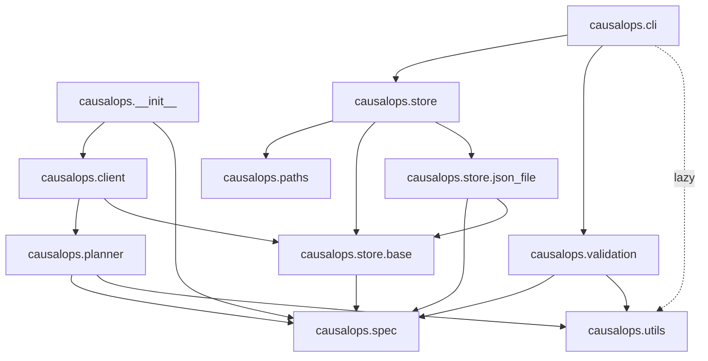

# Architecture

## Module dependency graph



Solid arrows are import-time dependencies. The dashed arrow from `cli` to `utils` is a lazy import — Spark is only loaded when the `register` or `validate` commands actually run.

## Three personas

The package is designed around three distinct user roles, each touching a different slice of the module graph:

**Model producer** (spec + CLI `register` / `validate`)
:   The team that owns a causal model. They define a `ModelSpec` in a `model_spec.py` file, run `causalops validate` to check it against the live tables, and `causalops register` to persist the contract. Their surface is `causalops.spec` and the CLI.

**Platform team** (store + CLI `promote`)
:   The team that manages the model lifecycle. They promote versions through statuses (`experiment` → `challenger` → `production` → `retired`) using `causalops promote`. Their surface is `causalops.store` and the CLI.

**Consumer** (client + planner)
:   Downstream processes that query model results. They use `RegistryClient` to discover what's registered, then query results by version or status. Their surface is `causalops.client`, which delegates to the planner internally.

This separation means a consumer never needs to know about CLI flags or store internals, and a producer never needs to know how the planner resolves metrics.

## Why RegistryClient is a dataclass

Every consumer query needs two things: a store (to look up registrations and statuses) and a Spark session (to read result tables). Rather than passing both as arguments to every function call, `RegistryClient` bundles them into a single object:

```python
client = RegistryClient(store=get_store(), spark=spark)
client.get_results(family="uplift", status="production", metrics=[...])
```

This is a deliberate choice over module-level functions. A dataclass (rather than a full class with `__init__` logic) keeps the object transparent — you can see exactly what it holds, and testing is trivial because you can inject any `SpecStore` implementation.

## Why store is a subpackage with an ABC

The `causalops.store` subpackage is structured around `SpecStore`, an abstract base class that defines the storage contract. The concrete `JsonFileSpecStore` implements it for local development, storing everything in a single JSON file.

This abstraction exists for one reason: **Databricks portability**. On Databricks, the registry would live in a Delta table on Unity Catalog, not a JSON file. By coding all consumer and planner logic against the `SpecStore` ABC, swapping `JsonFileSpecStore` for a Delta-backed implementation changes exactly one thing — the return value of `get_store()`. Zero consumer code, zero planner code, and zero CLI code needs to change.

The `get_store()` factory reads `CAUSALOPS_STORE_CONFIG` from the environment to dispatch to the right backend, making the swap a deployment configuration change rather than a code change.

## Why the planner uses PySpark

The planner reads result tables and joins them using PySpark DataFrames, not pandas. This is a deliberate portability decision: on Databricks, Spark is the native execution engine. By writing planner logic in PySpark, the same code runs unchanged on a Databricks cluster reading Unity Catalog tables or on a developer's laptop reading local Parquet files.

The `read_table` helper in `causalops.utils` is the bridge — it inspects the table path and uses `spark.read.parquet()` for filesystem paths or `spark.table()` for catalog identifiers. The planner doesn't know or care which path is taken.
